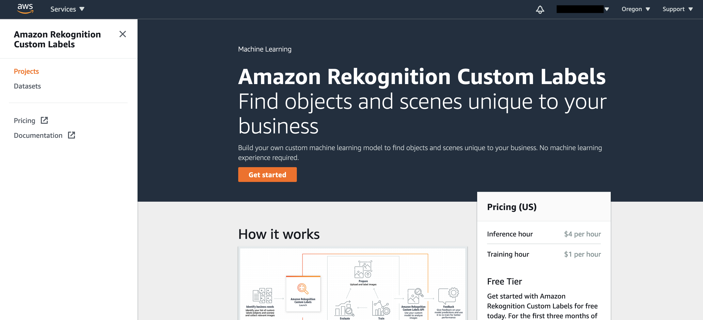
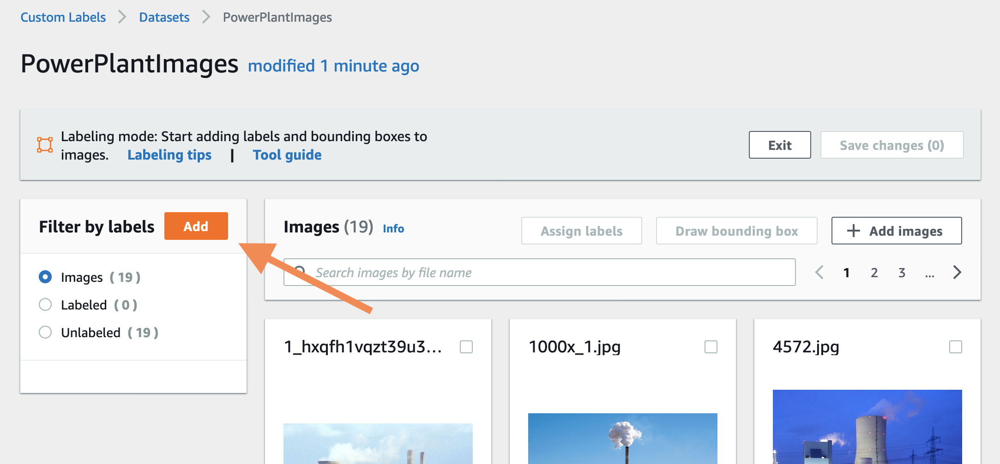
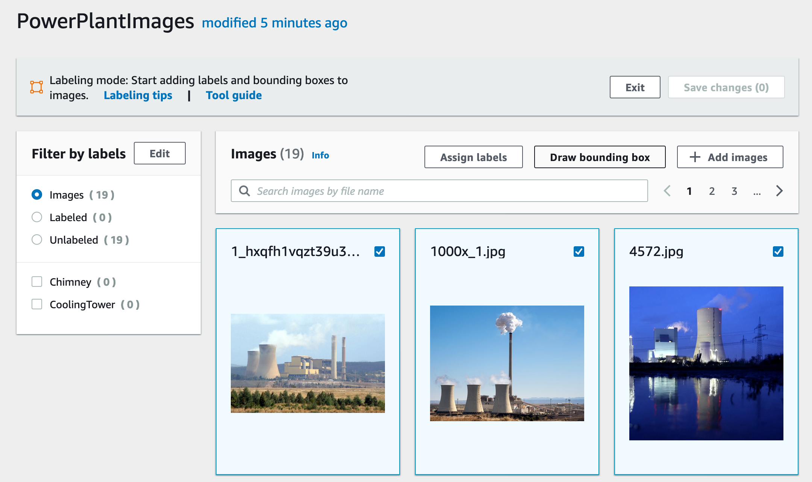
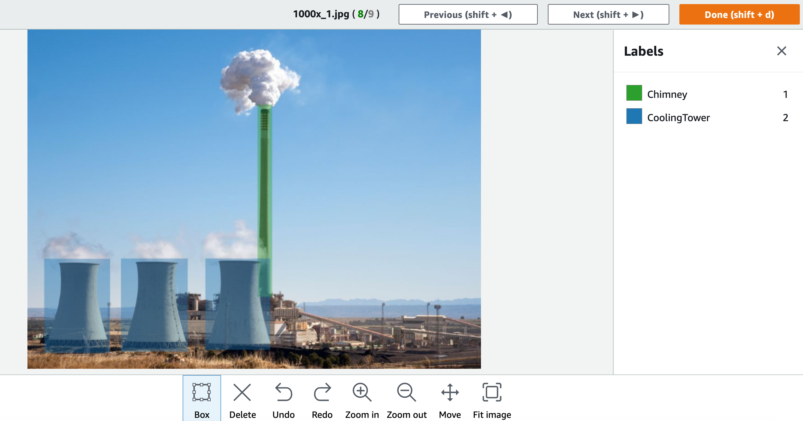
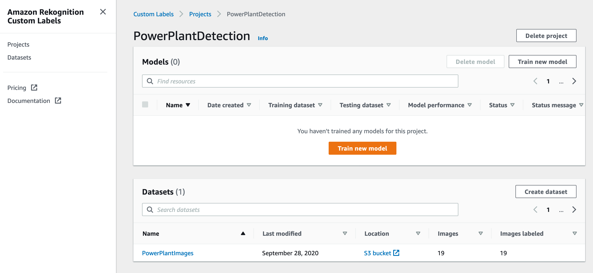
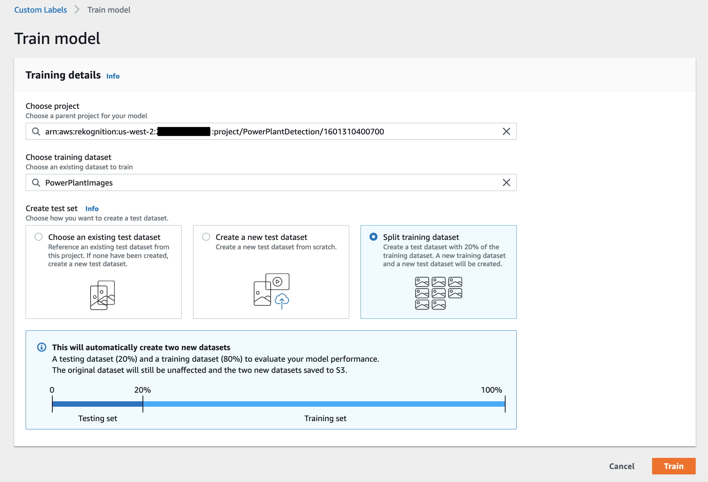
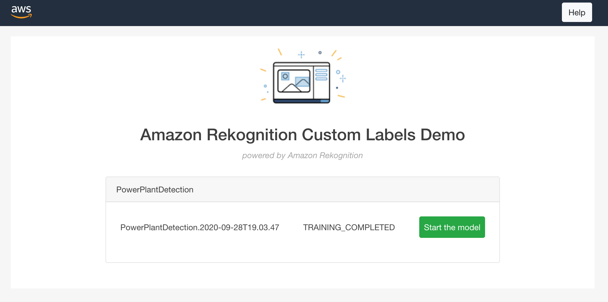

# Amazon Rekognition Custom Labels Lab

One challenge for certain business cases is to detect objects in images that are not part of the default Amazon Rekognition model. To address this issue [Amazon Rekognition custom labels](https://aws.amazon.com/rekognition/custom-labels-features/) provides the possibility to train a model with your own images and labels. This lab walks you through the steps of creating the required dataset, labeling the important objects in the images and finally training the model.

For this lab we will use an image set of power plants and detect cooling towers and chimneys in the images. The lab is not restricted to these images and can be run with an image set of your choice.

One prerequisite is that one of the regions is selected where Amazon Rekognition is already available, i.e. us-east-1, us-east-2 or eu-west-1.

## Deploy Rekognition Custom Labels Demo App

To get started the first step is to deploy the [Amazon Rekognition Custom Labels Demo](https://github.com/aws-samples/amazon-rekognition-custom-labels-demo). The demo app deploys a web application that makes it easy to interact with the model as soon it is trained and available.

Please follow these [deployment instructions](https://github.com/SaschaRodekamp/amazon-rekognition-custom-labels-demo#deployment)

While the CloudFormation Stack is deploying, we can prepare the model with the custom labels.

## Create a custom labels project

Go to the [Amazon Rekognition Console](https://console.aws.amazon.com/rekognition/home?)

1. Choose `Use Custom Labels` from the main menu on the left.
2. If you see the Amazon Rekognition Custom Labels splash screen, click `Get started`.
3. Type a project name "PowerPlantDetection".
4. Click `Create Project`.

  

## Create the Dataset

To use within the Project, a Dataset with the custom images needs to be created. A Dataset contains images, labels and bounding boxes which will be used to train a model.

1. In the menu on the left choose `Datasets`.
2. Click `Create dataset`.
3. Enter a name for the Dataset "PowerPlantImages".
4. Choose `Upload images from your computer` from the tiles.
5. Click `Submit` (lower right of the page).

The 'tool guide' will open automatically, take a few minutes to go through the tips before closing the popup.

6. Click `Add images` and `Choose files` from the popup.
7. Select all files from the training folder.
8. Click `Upload images` at the bottom of the image list.

The images are now being uploaded to the dataset.

## Labeling Data

To tell the model which objects are of interest in the pictures, the objects need to be labeled. For that, we can draw a bounding box around the objects in each image. One image can be labeled with multiple bounding boxes and different bounding boxes can overlap.

To get more information, click `Labeling tips`.

### Add Labels

1. First we create the needed labels. Click `Add` in the label overview box (Filter by labels).  

  

2. Type in the name of the first label "CoolingTower" and hit `Add label`.
3. Add a second label "Chimney" and click `Add label`.
4. Close the dialog with `Save`.

### The Labeling

1. Select all pictures on the first page.
2. Click `Draw bounding boxes`.

  

Take a few minutes to read "Tips for Drawing Bounding Boxes" which opens automatically.

3. Select the label you want to mark in the image from the list on the right. The number beside each label is the shortcut to quickly select the label.
4. Draw a box around the object on the image.
5. If you want to label a second object, select the appropriate label from the list (or by using the short key) and draw the box around any additional object.

  

6. As soon all objects are marked, click `Next` to jump to the next image.
7. Continue until all objects in all images are labeled, then click `Done` to save everything.
8. Jump to the next page of images and start over from point 3. until all images are labeled.
9. Remember to save your bounding boxes by clicking on `Save Changes` in the upper right corner.

## Training the model

1. From the main menu on the left choose `Projects`.
2. Select the created project "PowerPlantDetection".
2. Click `Train new Model`.

  

3. In the Training Details choose:
    - Choose training dataset: "PowerPlantImages".
    - Select `Split training dataset` from the tiles.
    - Click `Train` to start the training process.
    

      
    

Back on the project detail page the model will have the status "TRAINING_IN_PROGRESS" until the process has finished.

## Starting the model

1. Go back to the [AWS CloudFormation Console](https://console.aws.amazon.com/cloudformation/home?)
1. Choose `Stacks` from the menu on the left. Then select the "CustomLabelsDemo" stack from the list.
1. Select the `Output` tab and click on the link which is listed as the value of `url`.
1. Log in with the e-mail address you provided during the creation of the CloudFormation stack and the temporary password sent to you. You will be prompted to enter a new password.
1. After logging in, you can see your model on the dashboard. Click on `Start the model`.

  

1. When prompted, enter "1" as the minimum number of inference units to use. Select `Start the model` and then close the popup window.
1. After a few minutes the model will be running. Try it out by uploading one of the images from the test folder. You can also choose your own image.
